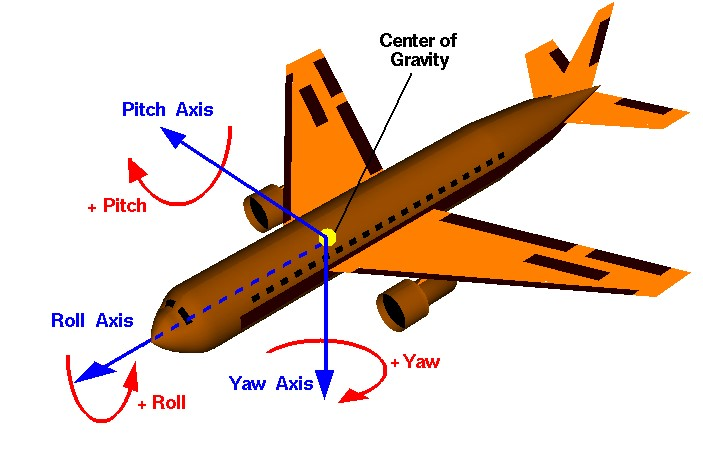

# Attitude controller

このパッケージはlocalization結果を用いてロボットのYaw軸を制御する。


## Package URL

repo url: [control/attitude_controller](https://github.com/hakoroboken/roboware-neo.universe/tree/main/control/attitude_controller)

## Launch

```bash
ros2 launch roboware_neo_launch attitude.launch.xml
```

## Topics

| Name              | Type                                   | Description                                  |
|-------------------|----------------------------------------|----------------------------------------------|
| output/twist      | geometry_msgs::msg::Twist              | 変換されたTwistデータを配信するパブリッシャー      |
| debug/pid_debug   | rw_common_msgs::msg::PIDDebug          | PID制御のデバッグ情報を配信するパブリッシャー      |
| input/sensor_pose | geometry_msgs::msg::PoseStamped        | センサから受信するPoseStampedデータのサブスクライバー |
| input/cmd_pose    | geometry_msgs::msg::Pose               | 指令されたPoseデータを受信するサブスクライバー      |

## Parameters

| Name               | Type   | Default Value | Description                              |
|--------------------|--------|---------------|------------------------------------------|
| p_gain             | double | 1.0           | 角度制御用の比例ゲイン                     |
| d_gain             | double | 0.1           | 角度制御用の微分ゲイン                     |
| max_velocity_m/s   | double | 3.0           | 最大直線速度                              |
| max_angular_m/s    | double | 1.0           | 最大角速度                                |