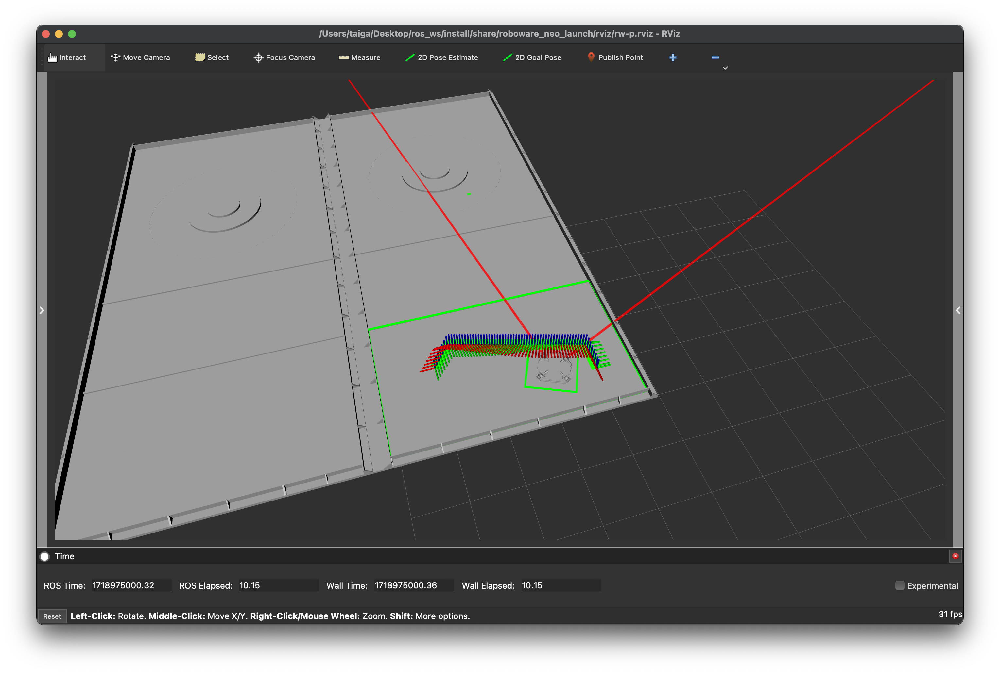
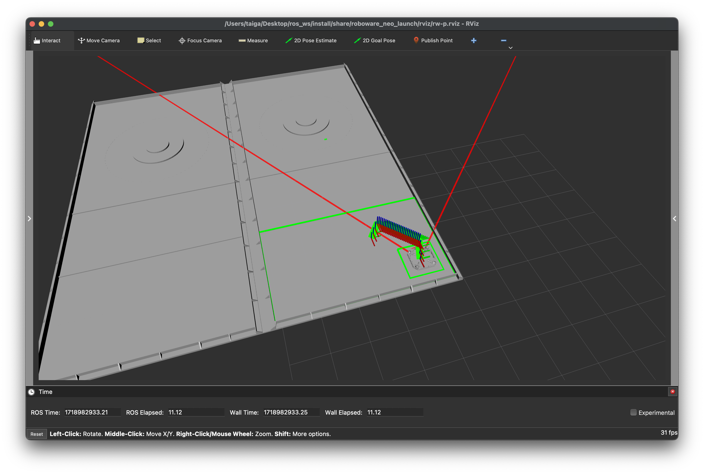
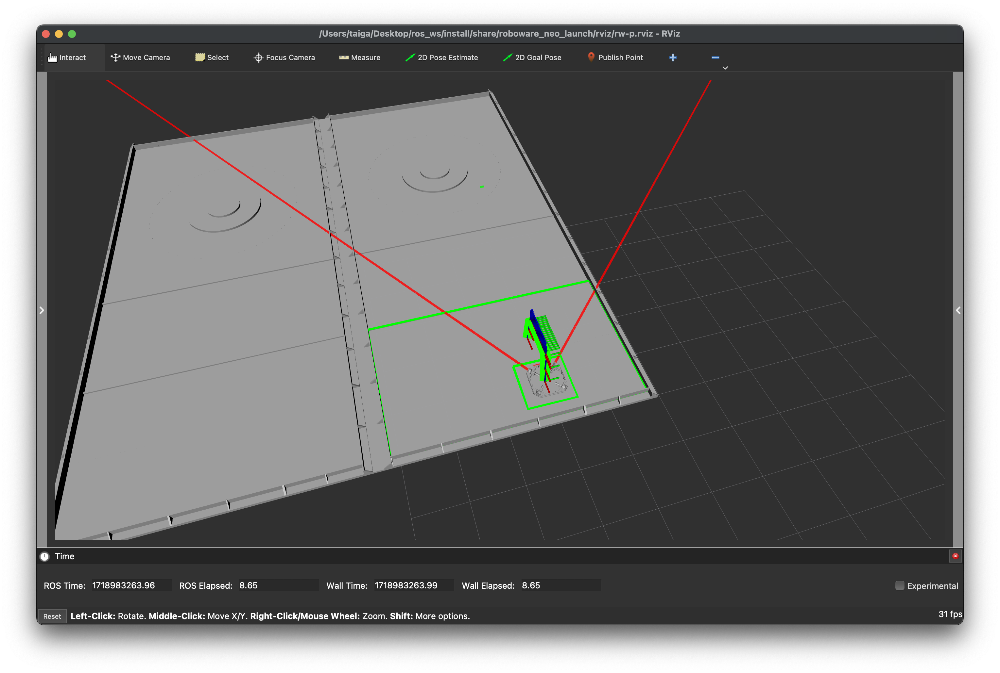

# Tutorials

## Scenario Planning Simulation

### Basic Scenario

This is a simulation to test a basic scenario.

1. Launch Roboware-neo:
    ```bash
    ros2 launch roboware_neo_launch planning_sim.launch.xml
    ```

    

2. Exit the simulation:

    Once the scenario has finished running, exit by pressing `ctrl-c` in the terminal.

3. Check the scenario flow chart:

    Let's check the scenario that was just executed at `roboware-neo.universe/launch/roboware_neo_launch/state_graph/s-graph.md`. You will see that the SETPOSE command is executed three times.

    ```mermaid
    graph TB
    START(START) --> SETPOSE.1(SETPOSE:x=-0.8,y=2.0,z=90.0)
    SETPOSE.1 --> SETPOSE.2(SETPOSE:x=-4.0,y=1.8,z=180.0)
    SETPOSE.2 --> SETPOSE.3(SETPOSE:x=-0.9,y=0.9,z=270.0)
    SETPOSE.3 --> END(END)
    ```

### If Statement Scenario

This scenario runs a more complex simulation involving if statements.

1. Edit the launch file:

    Edit `roboware-neo.universe/launch/roboware_neo_launch/launch/planning/mission_manager.launch.xml` as follows:

    ```xml
    <launch>  
        <!-- <arg name="graph_path" default="$(find-pkg-share roboware_neo_launch)/state_graph/s-graph.md"/> -->
        <arg name="graph_path" default="$(find-pkg-share roboware_neo_launch)/state_graph/c-graph.md"/>
        <!-- <arg name="graph_path" default="$(find-pkg-share roboware_neo_launch)/state_graph/scenario_simulation/rotation.md"/> -->
        <!-- <arg name="graph_path" default="$(find-pkg-share roboware_neo_launch)/state_graph/scenario_simulation/loop.md"/> -->

        <node pkg="mission_manager" exec="mission_manager_node" output="screen">
            <remap from="output/task_action" to="/planning/state_transition/task_action"/>
            <remap from="input/action_result" to="/planning/state_transition/action_result"/>
            <param name="graphpath" value="$(var graph_path)"/>
            <param name="endmode" value="shutdown"/>
        </node>

        <node pkg="mission_manager" exec="ar_marker_strategy_node" output="screen">
            <remap from="output/action_result" to="/planning/state_transition/action_result"/>
            <remap from="input/task_action" to="/planning/state_transition/task_action"/>
            <remap from="input/marker" to="/perception/ar_marker/marker"/>
        </node>
    </launch>
    ```

2. Launch Roboware-neo:
    ```bash
    ros2 launch roboware_neo_launch planning_sim.launch.xml
    ```

    

3. Check the scenario flow chart:

    Check the executed scenario at `roboware-neo.universe/launch/roboware_neo_launch/state_graph/c-graph.md`. The flow chart shows an if-else branch where the robot either returns to the start position or moves backward based on whether it finds the marker ID-6. By default, it does not find ID-6 and moves backward.

    ```mermaid
    graph TB
    START(START) --> SETPOSE.1(SETPOSE:x=-2.0,y=2.0,z=270.0)
    SETPOSE.1 --> FIND.1(FIND:type=armarker,name=6,var=id5pos)
    FIND.1 -- TRUE --> SETPOSE.2(SETPOSE:x=-2.0,y=0.9,z=270.0)
    FIND.1 -- FALSE --> SETPOSE.3(SETPOSE:x=-0.9,y=0.9,z=270.0)
    SETPOSE.2 --> END(END)
    SETPOSE.3 --> END(END)
    ```

4. Change the graph:

    Edit `roboware-neo.universe/launch/roboware_neo_launch/state_graph/c-graph.md` to change the marker ID to 5.

    ```markdown
    ```mermaid
    graph TB
    START(START) --> SETPOSE.1(SETPOSE:x=-2.0,y=2.0,z=270.0)
    SETPOSE.1 --> FIND.1(FIND:type=armarker,name=5,var=id5pos)
    FIND.1 -- TRUE --> SETPOSE.2(SETPOSE:x=-2.0,y=0.9,z=270.0)
    FIND.1 -- FALSE --> SETPOSE.3(SETPOSE:x=-0.9,y=0.9,z=270.0)
    SETPOSE.2 --> END(END)
    SETPOSE.3 --> END(END)
    ```
    ```

5. Launch Roboware-neo:

    ```bash
    ros2 launch roboware_neo_launch planning_sim.launch.xml
    ```

    

