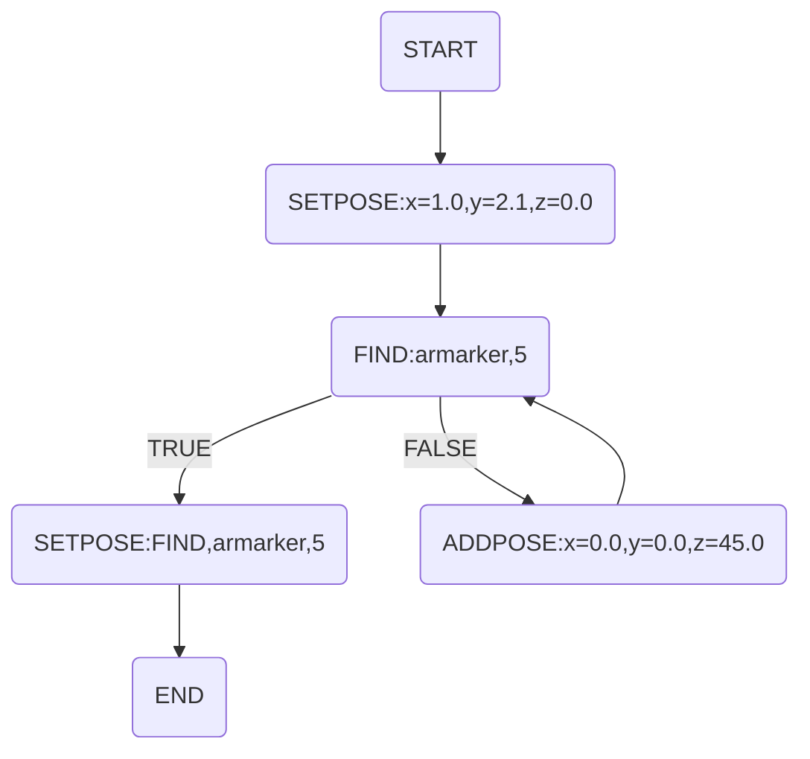

```mermaid
graph TB
  START(START) --> SETPOSE.1(SETPOSE:x=1.0,y=2.1,z=0.0)
  SETPOSE.1 --> FIND.1(FIND:armarker,5)
  FIND.1 -- TRUE --> SETPOSE.2(SETPOSE:FIND,armarker,5)
  FIND.1 -- FALSE --> ADDPOSE.1(ADDPOSE:x=0.0,y=0.0,z=45.0)
  ADDPOSE.1 --> FIND.1
  SETPOSE.2 --> END(END)
```
