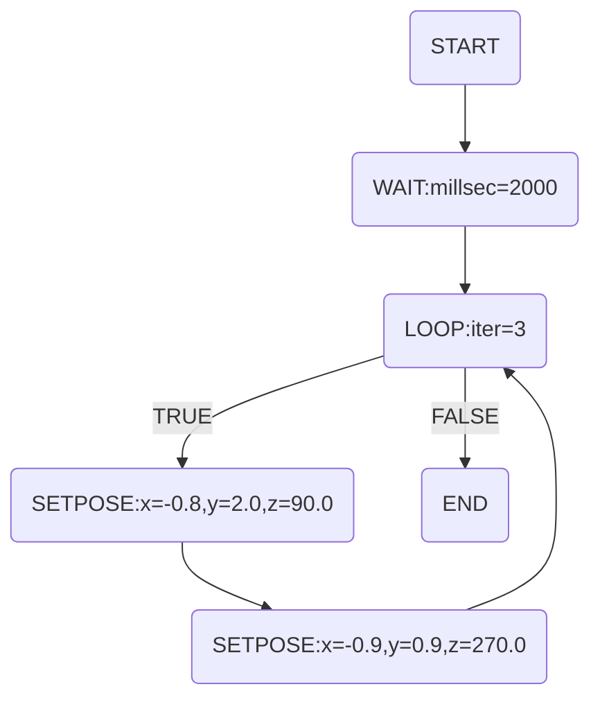

```mermaid
graph TB
  START(START) --> start_wait(WAIT:millsec=2000)
  start_wait --> loop(LOOP:iter=3)
  loop -- TRUE --> SETPOSE.1(SETPOSE:x=-0.8,y=2.0,z=90.0)
  SETPOSE.1 --> SETPOSE.2(SETPOSE:x=-0.9,y=0.9,z=270.0)
  SETPOSE.2 --> loop
  loop -- FALSE --> End(END)
```
