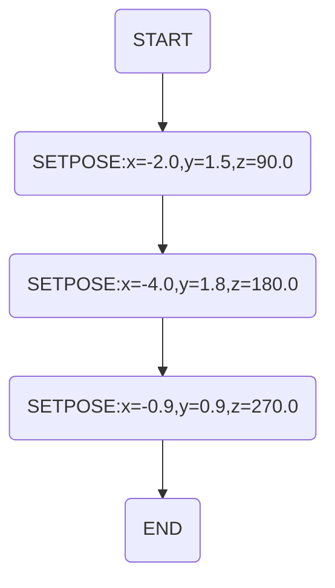

```mermaid
graph TB
  START(START) --> SETPOSE.1(SETPOSE:x=-2.0,y=1.5,z=90.0)
  SETPOSE.1 --> SETPOSE.2(SETPOSE:x=-4.0,y=1.8,z=180.0)
  SETPOSE.2 --> SETPOSE.3(SETPOSE:x=-0.9,y=0.9,z=270.0)
  SETPOSE.3 --> END(END)
```
