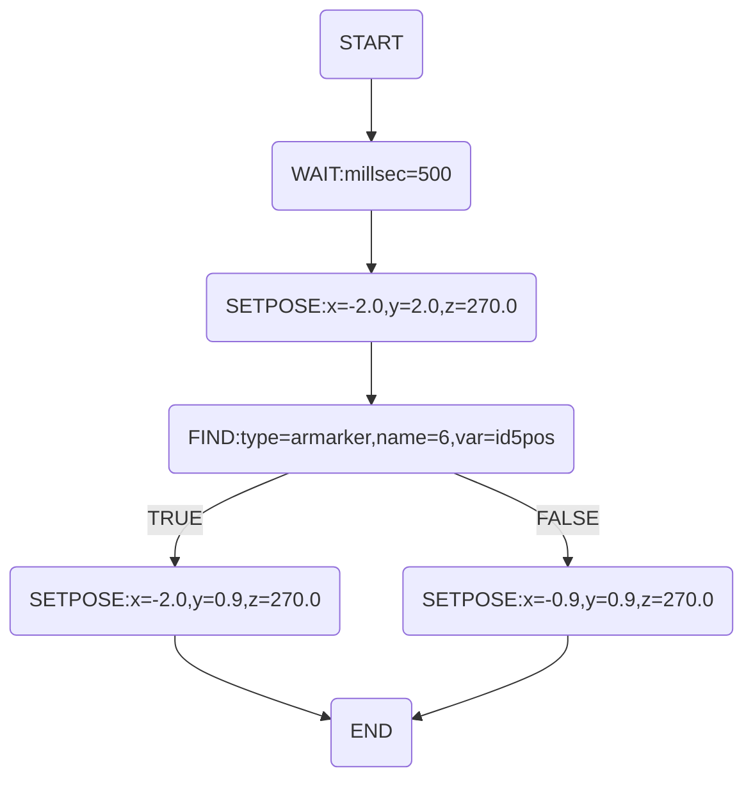

```mermaid
graph TB
  START(START) --> start_wait(WAIT:millsec=500)
  start_wait --> SETPOSE.1(SETPOSE:x=-2.0,y=2.0,z=270.0)
  SETPOSE.1 --> FIND.1(FIND:type=armarker,name=6,var=id5pos)
  FIND.1 -- TRUE --> SETPOSE.2(SETPOSE:x=-2.0,y=0.9,z=270.0)
  FIND.1 -- FALSE --> SETPOSE.3(SETPOSE:x=-0.9,y=0.9,z=270.0)
  SETPOSE.2 --> END(END)
  SETPOSE.3 --> END(END)
```
