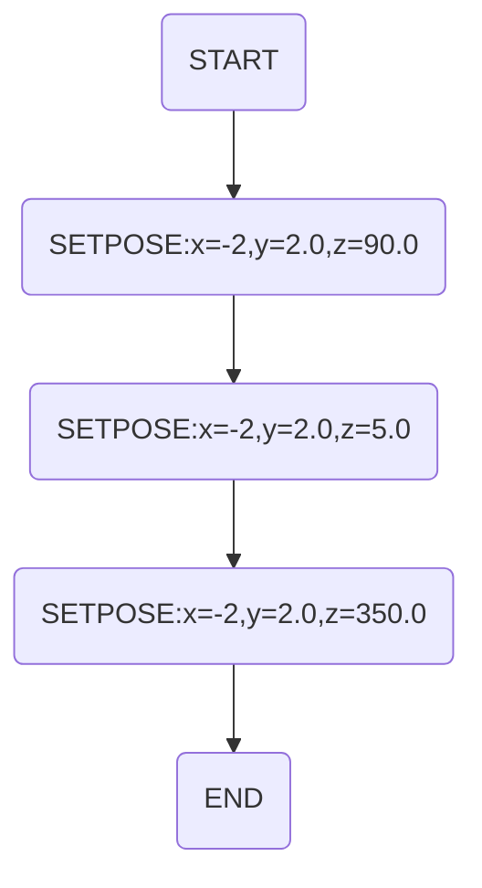

```mermaid
graph TB
  START(START) --> SETPOSE.1(SETPOSE:x=-2,y=2.0,z=90.0)
  SETPOSE.1 --> SETPOSE.2(SETPOSE:x=-2,y=2.0,z=5.0)
  SETPOSE.2 --> SETPOSE.3(SETPOSE:x=-2,y=2.0,z=350.0)
  SETPOSE.3 --> END(END)
```
